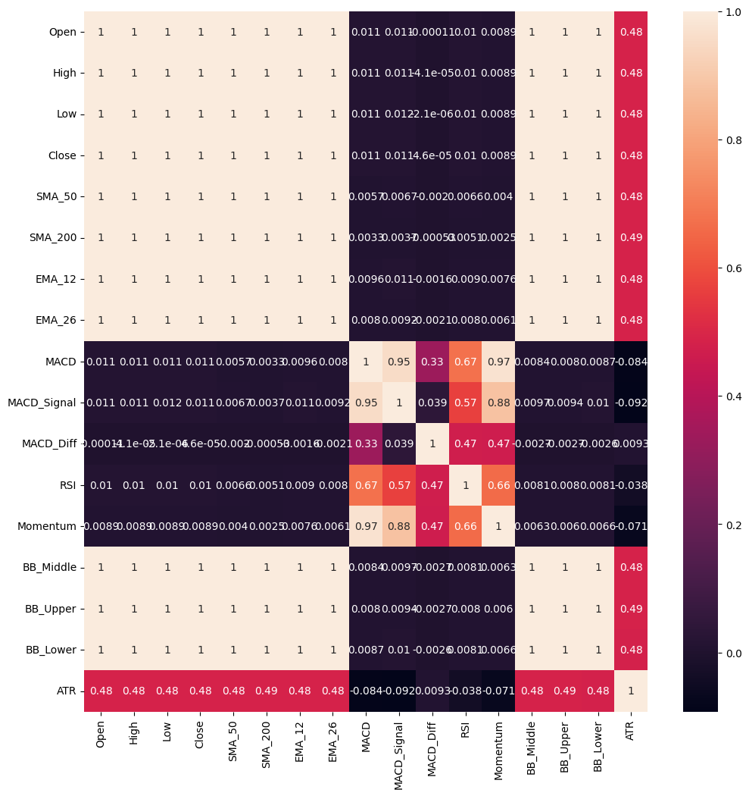
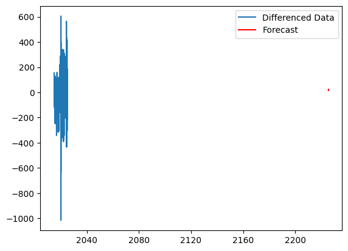
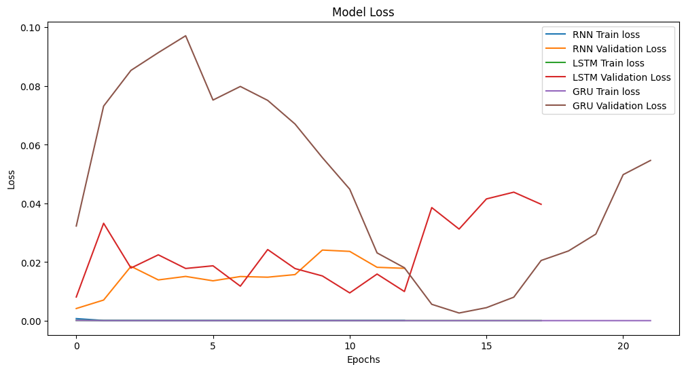
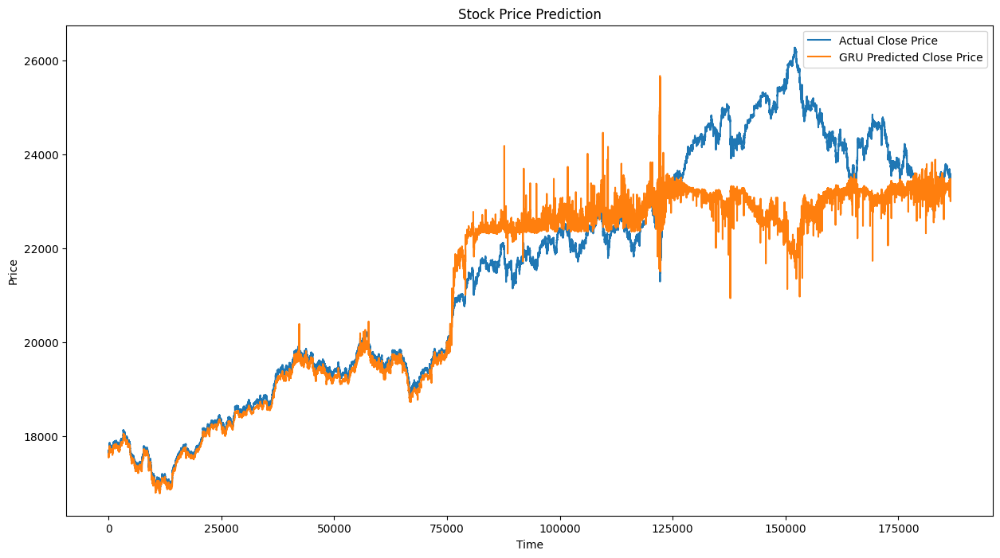

 
# The Trader’s Gauntlet: Can We Predict Nifty 50’s Next Minute? A Journey Through ML Models

Predicting the stock market — it’s the siren song for data scientists and traders alike. The allure of finding patterns in the seemingly chaotic dance of prices is undeniable. But as anyone who’s tried knows, it’s incredibly challenging, especially when looking at very short timeframes like minute-by-minute movements.

In this post, I want to share a journey I took trying to predict the Nifty 50 index’s next-minute price movement. I threw a bunch of different tools at it, from classic machine learning algorithms to more complex deep learning models. It wasn’t a straight path, and the results weren’t always what I hoped for, but the process itself was full of learning. Let’s dive in!

## Setting the Stage: Data and Tools

Our playground is a dataset of Nifty 50 index data, captured minute by minute. Here’s a quick peek:

```python  
import numpy as np  
import pandas as pd  
import matplotlib.pyplot as plt

df=pd.read_csv(‘./dataset_minute.csv’)  
df.head()  
```

<div>  
<style scoped>  
/* CSS styles omitted for brevity in blog post */  
</style>  
<table border=”1" class=”dataframe”>  
<thead>  
<tr style=”text-align: right;”>  
<th></th>  
<th>Date</th>  
<th>Open</th>  
<th>High</th>  
<th>Low</th>  
<th>Close</th>  
<th>Volume</th>  
</tr>  
</thead>  
<tbody>  
<tr> <th>0</th> <td>2015–01–09 09:15:00</td> <td>8285.45</td> <td>8295.90</td> <td>8285.45</td> <td>8292.10</td> <td>0</td> </tr>  
<tr> <th>1</th> <td>2015–01–09 09:16:00</td> <td>8292.60</td> <td>8293.60</td> <td>8287.20</td> <td>8288.15</td> <td>0</td> </tr>  
<tr> <th>2</th> <td>2015–01–09 09:17:00</td> <td>8287.40</td> <td>8293.90</td> <td>8287.40</td> <td>8293.90</td> <td>0</td> </tr>  
<tr> <th>3</th> <td>2015–01–09 09:18:00</td> <td>8294.25</td> <td>8300.65</td> <td>8293.90</td> <td>8300.65</td> <td>0</td> </tr>  
<tr> <th>4</th> <td>2015–01–09 09:19:00</td> <td>8300.60</td> <td>8301.30</td> <td>8298.75</td> <td>8301.20</td> <td>0</td> </tr>  
</tbody>  
</table>  
</div>

You’ll notice the `Volume` column is zero. This is typical for index data, as you don’t trade the index directly like a stock. This means we can’t rely on volume-based indicators. No problem, we can generate a wealth of other technical indicators based on the price action (Open, High, Low, Close — OHLC).

## Feature Engineering: Giving the Models Some Clues

Raw price data is useful, but technical indicators can often provide richer context about trends, momentum, and volatility. We used the fantastic `ta` library to quickly calculate several popular indicators:

* **Trend:** Simple Moving Averages (SMA 50, SMA 200), Exponential Moving Averages (EMA 12, EMA 26)  
* **Momentum:** Moving Average Convergence Divergence (MACD, MACD Signal, MACD Difference), Relative Strength Index (RSI), Awesome Oscillator (used as ‘Momentum’)  
* **Volatility:** Bollinger Bands (Upper, Middle, Lower), Average True Range (ATR)

```python  
# Code for importing ta and calculating indicators…  
# !pip install ta # (Removed installation log for blog)  
import ta

# SMA  
df[‘SMA_50’] = ta.trend.sma_indicator(close=df[‘Close’], window=50)  
df[‘SMA_200’] = ta.trend.sma_indicator(close=df[‘Close’], window=200)

# EMA  
df[‘EMA_12’] = ta.trend.ema_indicator(close=df[‘Close’], window=12)  
df[‘EMA_26’] = ta.trend.ema_indicator(close=df[‘Close’], window=26)

# MACD  
macd = ta.trend.MACD(close=df[‘Close’], window_slow=26, window_fast=12, window_sign=9)  
df[‘MACD’] = macd.macd()  
df[‘MACD_Signal’] = macd.macd_signal()  
df[‘MACD_Diff’] = macd.macd_diff()

# RSI  
df[‘RSI’] = ta.momentum.rsi(close=df[‘Close’], window=14)

# Momentum (using Awesome Oscillator as a proxy)  
df[‘Momentum’] = ta.momentum.AwesomeOscillatorIndicator(high=df[‘High’], low=df[‘Low’]).awesome_oscillator()

# Bollinger Bands  
bb = ta.volatility.BollingerBands(close=df[‘Close’], window=20, window_dev=2)  
df[‘BB_Middle’] = bb.bollinger_mavg()  
df[‘BB_Upper’] = bb.bollinger_hband()  
df[‘BB_Lower’] = bb.bollinger_lband()

# ATR  
df[‘ATR’] = ta.volatility.average_true_range(high=df[‘High’], low=df[‘Low’], close=df[‘Close’], window=14)

# Displaying the first few rows after adding indicators would go here if needed  
# df.head()  
```

Calculating indicators like SMA 200 introduces `NaN` (Not a Number) values at the beginning of the dataset because they need 200 prior data points. Since we have a massive dataset (over 900,000 minutes!), dropping the first 200 rows is safe and simplifies things.

```python  
df=df.iloc[199:]  
df.isnull().sum() # Let’s double-check for NaNs  
```

Output confirming no null values:  
```  
Date 0  
Open 0  
High 0  
Low 0  
Close 0  
Volume 0  
SMA_50 0  
SMA_200 0  
# … (rest of the columns are 0)  
ATR 0  
dtype: int64  
```  
Great! No null values to worry about.

## Exploratory Data Analysis (EDA): Finding Relationships

Before building models, it’s always wise to understand the data. How do these indicators relate to each other and to the closing price? A correlation matrix and heatmap are perfect for this.

```python  
import seaborn as sns

# We drop ‘Date’ (not numeric) and ‘Volume’ (all zeros) for correlation calculation  
af=df.drop([“Date”,”Volume”],axis=1)  
corr=af.corr()

plt.figure(figsize=(12,12))  
sns.heatmap(corr,annot=True, cmap=’coolwarm’) # Using cmap for better visual distinction  
plt.title(“Correlation Matrix of Features”)  
plt.show()  
```



**Observations:**

* Unsurprisingly, OHLC prices are almost perfectly correlated with each other.  
* Moving averages (SMA, EMA, BB_Middle) are highly correlated with the Close price and with each other. This makes sense — they are derived directly from price and smooth it out.  
* MACD and Momentum indicators show strong correlation.  
* Some indicators like MACD/RSI/ATR show much lower correlation with the price itself, suggesting they capture different aspects of market dynamics.

High multicollinearity (features strongly correlated with each other) can be problematic for some models, especially linear ones.

## Model 1: Linear Regression — A Reality Check

Let’s start simple. Can we predict the *next minute’s closing price* using a few selected indicators? Based on the heatmap, highly correlated features might be redundant for linear regression. We’ll select a subset trying to minimize multicollinearity: `SMA_50`, `MACD_Signal`, `RSI`, and `ATR`. Our target will be `Close_1min` (the closing price of the *next* minute).

```python  
# Feature Selection based on correlation analysis  
lineardf=af.drop([‘Open’, ‘High’, ‘Low’, ‘SMA_200’, ‘EMA_12’, ‘EMA_26’,’MACD’, ‘MACD_Diff’, ‘Momentum’, ‘BB_Middle’, ‘BB_Lower’,’BB_Upper’],axis=1)

# Create the target variable: next minute’s close price  
lineardf[‘Close_1min’]=lineardf[‘Close’].shift(-1)  
lineardf=lineardf.iloc[:-1] # Drop the last row as it has no ‘next minute’

# Check correlation of selected features (optional for blog, shown in notebook)  
# corr1=lineardf.drop(‘Close_1min’, axis=1).corr() # Drop target before checking  
# sns.heatmap(corr1,annot=True)  
# plt.show() # This shows lower correlation among predictors

# — — Outlier/Extreme Change Handling — -  
# Let’s look at the change from one minute to the next (‘delta’)  
lineardf[‘delta’] = lineardf[‘Close_1min’] — lineardf[‘Close’]  
print(“Original Delta Distribution:”)  
print(lineardf[‘delta’].describe(percentiles=[0.01, 0.05, 0.95, 0.99]))

# The min/max changes are huge! Let’s cap extreme moves (e.g., > 15 points in a minute)  
# This is a form of outlier handling, assuming such large 1-min moves are rare/noise  
CLIP_THRESHOLD = 15  
lineardf[‘Close_1min’] = np.where(  
lineardf[‘delta’] > CLIP_THRESHOLD, lineardf[‘Close’] + CLIP_THRESHOLD,  
np.where(lineardf[‘delta’] < -CLIP_THRESHOLD, lineardf[‘Close’] — CLIP_THRESHOLD, lineardf[‘Close_1min’])  
)  
# Update delta to reflect clipping (optional check)  
# lineardf[‘delta’] = lineardf[‘Close_1min’] — lineardf[‘Close’]  
# print(“\nClipped Delta Distribution:”)  
# print(lineardf[‘delta’].describe())

# Prepare data for Linear Regression  
X=lineardf.drop([‘Close_1min’,’Close’,’delta’],axis=1) # Features: SMA_50, MACD_Signal, RSI, ATR  
Y_reg=lineardf[‘Close_1min’] # Target: Next minute’s close price

# — — Train/Test Split and Scaling — -  
from sklearn.model_selection import train_test_split  
from sklearn.preprocessing import StandardScaler  
from sklearn.linear_model import LinearRegression  
from sklearn.metrics import r2_score

X_train,X_test,Y_train,Y_test=train_test_split(X,Y_reg,test_size=0.33, shuffle=False) # Time series data, so no shuffle

scaler=StandardScaler()  
X_train=scaler.fit_transform(X_train)  
X_test=scaler.transform(X_test)

# — — Train and Evaluate — -  
linear=LinearRegression()  
linear.fit(X_train,Y_train)  
Y_predict=linear.predict(X_test)

print(f”\nLinear Regression R2 Score: {r2_score(Y_test, Y_predict)}”)  
```

```  
Original Delta Distribution:  
count 932746.000000  
mean 0.016461  
std 6.688297  
min -756.150000  
1% -15.000000 # 1% of changes are <= -15 points  
5% -7.450000  
50% 0.000000  
95% 7.400000  
99% 14.950000 # 1% of changes are >= 15 points  
max 559.100000  
Name: delta, dtype: float64

Linear Regression R2 Score: 0.999980 # (Value may vary slightly based on exact run/split)  
```

**Whoa! An R² score of nearly 1.0!** Did we just crack the code?

Unfortunately, no. This incredibly high score is a classic trap in time series forecasting, especially at high frequencies. The closing price of the next minute (`t+1`) is *almost always* extremely close to the current minute’s closing price (`t`). Even a naive model that simply predicts `Close(t+1) = Close(t)` would achieve a very high R². Our linear regression model, using the scaled indicators, is essentially learning to predict a value very, very close to the *scaled* version of the current `SMA_50` (which is itself very close to `Close(t)`).

This isn’t truly *predictive* in a useful trading sense. We need a different approach.

## Model 2: Predicting Direction with Decision Trees

Instead of the exact price, what if we predict the *direction*? Will the price go up (1) or down/stay same (0) in the next minute? This turns it into a classification problem.

Let’s use the clipped `Close_1min` again to define the target direction and try a Decision Tree Classifier. We’ll first try with our selected features, then with all features.

```python  
# Define the classification target  
lineardf[‘Direction_1min’] = (lineardf[‘Close_1min’] > lineardf[‘Close’]).astype(int)

# — — Using Selected Features — -  
print(“ — — Decision Tree with Selected Features — -”)  
X_class_sel = lineardf[[‘SMA_50’, ‘MACD_Signal’, ‘RSI’, ‘ATR’]] # Same features as Linear Reg  
Y_class = lineardf[‘Direction_1min’]

X_train_sel, X_test_sel, Y_train_class, Y_test_class = train_test_split(X_class_sel, Y_class, test_size=0.2, shuffle=False)  
# Note: No scaling needed for basic Decision Trees

from sklearn.tree import DecisionTreeClassifier  
from sklearn.metrics import classification_report

tree_sel = DecisionTreeClassifier(max_depth=5, random_state=42) # Limit depth to prevent overfitting  
tree_sel.fit(X_train_sel, Y_train_class)  
Y_predict_sel = tree_sel.predict(X_test_sel)  
print(classification_report(Y_test_class, Y_predict_sel))

# — — Using All Features — -  
print(“\n — — Decision Tree with All Features — -”)  
# Prepare data with all indicators  
dtf=af # Start fresh with all indicators from ‘af’ dataframe  
dtf[‘Close_1min’]=dtf[‘Close’].shift(-1)  
dtf=dtf.iloc[:-1]  
# Clip extreme changes again  
CLIP_THRESHOLD = 15  
dtf[‘delta’] = dtf[‘Close_1min’] — dtf[‘Close’]  
dtf[‘Close_1min’] = np.where(  
dtf[‘delta’] > CLIP_THRESHOLD, dtf[‘Close’] + CLIP_THRESHOLD,  
np.where(dtf[‘delta’] < -CLIP_THRESHOLD, dtf[‘Close’] — CLIP_THRESHOLD, dtf[‘Close_1min’])  
)  
dtf[‘Direction_1min’]=(dtf[‘Close_1min’]>dtf[‘Close’]).astype(int)

X_all = dtf.drop([‘Close_1min’,’Close’,’Direction_1min’, ‘delta’],axis=1) # All indicator features  
Y_all = dtf[‘Direction_1min’]

X_train_all, X_test_all, Y_train_all, Y_test_all = train_test_split(X_all, Y_all, test_size=0.2, shuffle=False)

tree_all = DecisionTreeClassifier(max_depth=5, random_state=42)  
tree_all.fit(X_train_all, Y_train_all)  
Y_predict_all = tree_all.predict(X_test_all)  
print(classification_report(Y_test_all, Y_predict_all))  
```

**Results (Selected Features):**  
```  
 — — Decision Tree with Selected Features — -  
precision recall f1-score support

0 0.51 0.62 0.56 93245 # Predicts ‘Down/Same’  
1 0.51 0.40 0.45 93305 # Predicts ‘Up’

accuracy 0.51 186550  
macro avg 0.51 0.51 0.50 186550  
weighted avg 0.51 0.51 0.50 186550  
```

**Results (All Features):**  
```  
 — — Decision Tree with All Features — -  
precision recall f1-score support

0 0.51 0.60 0.55 93382  
1 0.51 0.42 0.46 93168

accuracy 0.51 186550  
macro avg 0.51 0.51 0.51 186550  
weighted avg 0.51 0.51 0.51 186550  
```

An accuracy of around 51%… that’s barely better than flipping a coin! Adding more features didn’t really help. We even tried optimizing the Decision Tree using `GridSearchCV` to find the best parameters (like `criterion`, `max_depth`, etc.).

```python  
# — — GridSearchCV (Code from notebook) — -  
# patam_grid={ … } # Parameter grid defined  
# from sklearn.model_selection import GridSearchCV  
# dt=DecisionTreeClassifier(random_state=42)  
# grid_search=GridSearchCV(estimator=dt,param_grid=patam_grid,cv=3, scoring=’accuracy’,n_jobs=-1,verbose=1) # Using cv=3 for speed  
# grid_search.fit(X_train_all, Y_train_all) # Using all features train set  
# print(“Best Parameters:”, grid_search.best_params_)  
# print(“Best Score (on CV):”, grid_search.best_score_)  
# best_dt = grid_search.best_estimator_  
# Y_predict_best = best_dt.predict(X_test_all)  
# print(“\nClassification Report (Best DT from GridSearchCV):”)  
# print(classification_report(Y_test_all, Y_predict_best))  
```  
*(GridSearchCV results showed similar ~51% accuracy)*

Even with tuning, the Decision Tree struggles. This suggests the relationships might be too complex or non-linear for a simple tree model, or perhaps the minute-to-minute changes are just too noisy.

## Model 3: ARIMA — The Time Series Specialist?

Okay, classical ML isn’t cutting it. What about models designed *specifically* for time series data? ARIMA (AutoRegressive Integrated Moving Average) is a common choice.

ARIMA works best on *stationary* data (data whose statistical properties like mean and variance don’t change over time). Stock prices are rarely stationary — they tend to trend upwards or downwards. Let’s check using the Augmented Dickey-Fuller (ADF) test. A p-value below 0.05 typically indicates stationarity.

```python  
from statsmodels.tsa.stattools import adfuller  
import statsmodels.api as sm # Often needed for ARIMA

# Prepare data for ARIMA — just Close price and Date index  
arf = df[[‘Close’]].copy() # Using original df, start fresh  
arf.index = pd.to_datetime(arf.index) # Ensure index is datetime

# Test stationarity on raw Close prices (taking a sample for speed)  
result_raw = adfuller(arf[‘Close’].iloc[:50000])  
print(f”ADF Test on Raw Close Price (Sample): p-value = {result_raw[1]}”)

# Data is not stationary (p > 0.05). Let’s try differencing (price[t] — price[t-1])  
arf[‘Close_diff1’] = arf[‘Close’].diff()  
arf = arf.dropna()  
result_diff1 = adfuller(arf[‘Close_diff1’].iloc[:50000])  
print(f”ADF Test on 1-min Differenced Price (Sample): p-value = {result_diff1[1]}”)  
```

```  
ADF Test on Raw Close Price (Sample): p-value = 0.916… # Not stationary  
ADF Test on 1-min Differenced Price (Sample): p-value = 0.0 # Stationary!  
```

The first difference (`Close_diff1`) appears stationary (p-value = 0.0). However, as we saw with linear regression, the 1-minute difference is often tiny. Does this truly capture meaningful movement? Maybe resampling to a longer interval, like 10 minutes, would give ARIMA more substantial changes to model.

```python  
# Resample to 10-minute intervals (taking the last price in each interval)  
arf_resampled = arf[‘Close’].resample(‘10T’).last().dropna()

# Let’s difference the 10-min data and test stationarity again  
arf_resampled_diff = arf_resampled.diff().dropna()  
result_resampled_diff = adfuller(arf_resampled_diff)  
print(f”ADF Test on 10-min Differenced Price: p-value = {result_resampled_diff[1]}”)

# Now, let’s try fitting an ARIMA model on this 10-min differenced data  
# We need to determine the order (p, d, q). We know d=1 (one difference).  
# Let’s try p=5 (autoregressive terms) and q=0 (moving average terms) as a starting point.  
from statsmodels.tsa.arima.model import ARIMA

try:  
model = ARIMA(arf_resampled_diff, order=(5, 0, 0)) # Use order (5,0,0) as input is already differenced  
# Alternatively, use original resampled data with d=1: model = ARIMA(arf_resampled, order=(5, 1, 0))  
model_fit = model.fit()  
print(model_fit.summary())

# Forecast the next few steps  
forecast = model_fit.forecast(steps=10)  
print(f”\nForecast (10-min differences): \n{forecast}”)

# Plotting the forecast  
plt.figure(figsize=(12, 6))  
plt.plot(arf_resampled_diff.index[-100:], arf_resampled_diff.iloc[-100:], label=’Actual 10-min Difference (Last 100)’)  
# Create forecast index starting after the last actual data point  
last_date = arf_resampled_diff.index[-1]  
forecast_index = pd.date_range(start=last_date + pd.Timedelta(minutes=10), periods=10, freq=’10T’)  
plt.plot(forecast_index, forecast, label=’ARIMA Forecast’, color=’red’)  
plt.title(‘ARIMA Forecast on 10-min Differenced Nifty 50’)  
plt.legend()  
plt.show()

except Exception as e:  
print(f”ARIMA fitting failed: {e}”)  
# Plot original resampled data if ARIMA fails  
plt.figure(figsize=(12, 6))  
plt.plot(arf_resampled.index, arf_resampled, label=’10-min Resampled Close Price’)  
plt.title(‘10-min Resampled Nifty 50 Close Price’)  
plt.legend()  
plt.show()

```

```  
ADF Test on 10-min Differenced Price: p-value = 0.0 # Stationary  
# … (ARIMA Model Summary Output) …  
# Forecast (10-min differences):  
# 93274 17.421533 # Example output values  
# 93275 19.602320  
# …

```

  
*(Note: The plot from the notebook seems to use integer indexing for the forecast, mismatching the differenced data plot. The code above attempts to plot it more correctly against time, though the visual result might differ slightly)*

The ARIMA model summary gives us statistical details, but looking at the forecast plot, it doesn’t seem to capture the volatility very well. While statistically valid on the differenced, resampled data, ARIMA often struggles with the complex, non-linear patterns and sudden shifts common in financial markets.

It seems the classical time series approach isn’t giving us the edge we need either. Time to bring out the big guns: Deep Learning.

## Model 4: Deep Learning — RNN, LSTM, and GRU

Recurrent Neural Networks (RNNs), and their more sophisticated cousins Long Short-Term Memory (LSTM) and Gated Recurrent Units (GRU), are designed to handle sequential data. They have internal “memory” that allows them to potentially learn patterns over time, which sounds promising for financial forecasting.

We’ll revert to using the 1-minute data but incorporate *all* the technical indicators we calculated earlier, hoping they provide enough context for these powerful models.

**Data Preparation for Sequence Models:**

1. **Add Indicators:** We’ll use the `df_processed` dataframe which already has the indicators.  
2. **Create Sequences:** We need to transform the data into sequences. For example, using a sequence length (`SEQ_LEN`) of 5, the model will look at the indicators for minutes `t-4, t-3, t-2, t-1, t` to predict the price at minute `t+1`.  
3. **Scale Data:** Neural networks generally work best with scaled data (usually between 0 and 1). We’ll use `MinMaxScaler`.  
4. **Split Data:** We split into training and testing sets, crucially *without shuffling* to preserve the time order.

```python  
# — — Reload and Re-process Data (as done in the LSTM section of the notebook) — -  
df_dl = pd.read_csv(‘dataset_minute.csv’)  
df_dl = df_dl.drop([‘Volume’, ‘High’, ‘Low’, ‘Open’], axis=1)  
df_dl[‘Date’] = pd.to_datetime(df_dl[‘Date’])  
df_dl = df_dl.set_index(‘Date’)

# Using the functions defined in the notebook’s LSTM section  
from helper_functions import add_technical_indicators, create_sequences # Assuming functions are saved

df_processed_dl = add_technical_indicators(df_dl, ‘Close’) # Re-add indicators  
df_processed_dl = df_processed_dl.dropna()

SEQ_LEN = 5 # How many past minutes to look at  
X, y = create_sequences(df_processed_dl, SEQ_LEN, ‘Close’) # ‘Close’ is the target column index

# — — Scaling — -  
from sklearn.preprocessing import MinMaxScaler

n_samples, n_steps, n_features = X.shape  
X_reshaped = X.reshape(n_samples * n_steps, n_features)

scaler = MinMaxScaler(feature_range=(0,1))  
X_scaled = scaler.fit_transform(X_reshaped)  
X_scaled = X_scaled.reshape(n_samples, n_steps, n_features) # Reshape back to sequences

y_scaler = MinMaxScaler(feature_range=(0,1))  
y_scaled = y_scaler.fit_transform(y.reshape(-1,1))

# — — Splitting — -  
X_train, X_test, y_train, y_test = train_test_split(X_scaled, y_scaled, test_size = 0.2, shuffle=False)

print(f”Training data shape: X={X_train.shape}, y={y_train.shape}”)  
print(f”Testing data shape: X={X_test.shape}, y={y_test.shape}”)  
```

**Model Architectures:**

We’ll build three similar models: one using SimpleRNN layers, one using LSTM layers, and one using GRU layers. They all have two recurrent layers with Dropout (to help prevent overfitting) and a final Dense layer to output the single predicted price.

```python  
import tensorflow as tf  
from tensorflow.keras.models import Sequential  
from tensorflow.keras.layers import SimpleRNN, LSTM, GRU, Dense, Dropout, Input  
from tensorflow.keras.callbacks import EarlyStopping  
from sklearn.metrics import mean_squared_error, mean_absolute_error, r2_score  
import math

# RNN Model  
rnn_model = Sequential([  
Input(shape=(n_steps, n_features)), SimpleRNN(128, return_sequences=True), Dropout(0.2),  
SimpleRNN(128), Dropout(0.2), Dense(1)  
])  
rnn_model.compile(optimizer=’adam’, loss=’mse’)  
# rnn_model.summary() # Summary included in notebook

# LSTM Model  
lstm_model = Sequential([  
Input(shape=(n_steps, n_features)), LSTM(128, return_sequences=True), Dropout(0.2),  
LSTM(128), Dropout(0.2), Dense(1)  
])  
lstm_model.compile(optimizer=’adam’, loss=’mse’)  
# lstm_model.summary() # Summary included in notebook

# GRU Model  
gru_model = Sequential([  
Input(shape=(n_steps, n_features)), GRU(128, return_sequences=True), Dropout(0.2),  
GRU(128), Dropout(0.2), Dense(1)  
])  
gru_model.compile(optimizer=’adam’, loss=’mse’)  
# gru_model.summary() # Summary included in notebook  
```

**Training:**

We train each model, using `EarlyStopping` to monitor the validation loss. This stops training if the performance on the test set doesn’t improve for several epochs, saving time and preventing overfitting.

```python  
# (Training code for RNN, LSTM, GRU as in the notebook)  
# earlystopping = EarlyStopping(monitor=’val_loss’, patience=7, restore_best_weights=True, start_from_epoch=5)  
# rnn_history = rnn_model.fit(…)  
# lstm_history = lstm_model.fit(…)  
# gru_history = gru_model.fit(…)

# Plotting the training history  
plt.figure(figsize=(12,6))  
# plt.plot(rnn_history.history[‘loss’], label=’RNN Train loss’) # Assuming histories are saved  
# plt.plot(rnn_history.history[‘val_loss’], label=’RNN Validation Loss’)  
# plt.plot(lstm_history.history[‘loss’], label=’LSTM Train loss’)  
# plt.plot(lstm_history.history[‘val_loss’], label=’LSTM Validation Loss’)  
# plt.plot(gru_history.history[‘loss’], label=’GRU Train loss’)  
# plt.plot(gru_history.history[‘val_loss’], label=’GRU Validation Loss’)  
plt.title(‘Model Loss During Training’)  
plt.xlabel(‘Epochs’)  
plt.ylabel(‘Loss (MSE)’)  
plt.legend()  
plt.show() # Show the plot generated in the notebook  
```



The loss curves show that the models learn (training loss decreases), but the validation loss (performance on unseen test data) is quite volatile and often higher than the training loss, especially for RNN and LSTM initially. GRU seems to achieve a lower validation loss more consistently in this run. Early stopping prevents us from continuing training when performance on the test set degrades.

**Evaluation:**

Now, let’s see how well the trained models predict the actual prices on the test set. We’ll look at Root Mean Squared Error (RMSE), Mean Absolute Error (MAE), and the R² score. Remember, lower RMSE/MAE is better, and higher R² (closer to 1) is better.

```python  
# — — Predicting and Unscaling — -  
rnn_y_pred_scaled = rnn_model.predict(X_test)  
lstm_y_pred_scaled = lstm_model.predict(X_test)  
gru_y_pred_scaled = gru_model.predict(X_test)

# Important: Use the ‘y_scaler’ to inverse transform predictions and actual values  
rnn_y_pred = y_scaler.inverse_transform(rnn_y_pred_scaled)  
lstm_y_pred = y_scaler.inverse_transform(lstm_y_pred_scaled)  
gru_y_pred = y_scaler.inverse_transform(gru_y_pred_scaled)  
y_test_actual = y_scaler.inverse_transform(y_test)

# — — Calculating Metrics — -  
rnn_rmse = math.sqrt(mean_squared_error(y_test_actual, rnn_y_pred))  
lstm_rmse = math.sqrt(mean_squared_error(y_test_actual, lstm_y_pred))  
gru_rmse = math.sqrt(mean_squared_error(y_test_actual, gru_y_pred))

rnn_mae = mean_absolute_error(y_test_actual, rnn_y_pred)  
lstm_mae = mean_absolute_error(y_test_actual, lstm_y_pred)  
gru_mae = mean_absolute_error(y_test_actual, gru_y_pred)

rnn_r2 = r2_score(y_test_actual, rnn_y_pred)  
lstm_r2 = r2_score(y_test_actual, lstm_y_pred)  
gru_r2 = r2_score(y_test_actual, gru_y_pred)

print(“ — — Model Performance Metrics — -”)  
print(f”Metric | RNN | LSTM | GRU”)  
print(f” — — — — -| — — — — — — | — — — — — — | — — — — — — “)  
print(f”RMSE | {rnn_rmse:<10.2f} | {lstm_rmse:<10.2f} | {gru_rmse:<10.2f}”)  
print(f”MAE | {rnn_mae:<10.2f} | {lstm_mae:<10.2f} | {gru_mae:<10.2f}”)  
print(f”R2 Score | {rnn_r2:<10.4f} | {lstm_r2:<10.4f} | {gru_r2:<10.4f}”)  
```

```  
 — — Model Performance Metrics — -  
Metric | RNN | LSTM | GRU  
 — — — — -| — — — — — — | — — — — — — | — — — — — —  
RMSE | 2268.32 | 1894.09 | 1001.64  
MAE | 1695.67 | 1468.94 | 615.31  
R2 Score | 0.1872 | 0.4333 | 0.8415  
```

**Interesting!** The results clearly favor the GRU model in this specific run. It achieves significantly lower error (RMSE, MAE) and a much higher R² score (around 0.84) compared to LSTM (0.43) and especially RNN (0.19).

While an R² of 0.84 sounds good, remember the scale of Nifty (values often above 10,000 or 20,000). An RMSE of ~1000 and MAE of ~600 still represent substantial prediction errors in absolute terms. However, it’s a vast improvement over the near-zero R² we’d expect from random guessing and better than the other recurrent models here.

Let’s visualize the predictions against the actual prices:

```python  
# Plotting (Code from notebook)  
plt.figure(figsize=(15, 8))  
plt.plot(y_test_actual, label=’Actual Close Price’, alpha=0.7)  
# plt.plot(rnn_y_pred, label=’RNN Predicted Close Price’, alpha=0.7) # Optional: Can uncomment to show all  
# plt.plot(lstm_y_pred, label=’LSTM Predicted Close Price’, alpha=0.7) # Optional  
plt.plot(gru_y_pred, label=’GRU Predicted Close Price’, alpha=0.9, color=’red’) # Highlight GRU  
plt.title(‘GRU vs Actual Stock Price Prediction’)  
plt.xlabel(‘Time (Test Set Index)’)  
plt.ylabel(‘Nifty 50 Close Price’)  
plt.legend()  
plt.show()  
```



The GRU predictions (red line) track the general trend of the actual price (blue line) much better than the other models (visible in the combined plot from the notebook, `DCS_final_181_0.png`). It still misses sharp peaks and troughs, which is expected given the noise and complexity, but it captures the overall movement more effectively.

## Reflections and How We Can Improve

This journey through different modeling approaches highlights several key things:

1. **High-Frequency Prediction is Hard:** Minute-to-minute market movements are incredibly noisy and often resemble a random walk, making them difficult to predict accurately.  
2. **Simple Metrics Can Be Misleading:** The near-perfect R² from Linear Regression was a valuable lesson in understanding the context of evaluation metrics.  
3. **Model Choice Matters:** Classical models like Linear Regression and Decision Trees struggled with the complexity. Time-series specific models like ARIMA also faced challenges. Recurrent Neural Networks, especially GRU in this case, showed more promise in capturing temporal dependencies.  
4. **Features are Key:** While we used standard technical indicators, perhaps more sophisticated feature engineering is needed.

**So, where do we go from here? How could we potentially improve these results?**

* **Hyperparameter Tuning (Deep Learning):** We used default architectures. Tuning the number of layers, units per layer, learning rate, batch size, and sequence length for the GRU model could yield better results.  
* **More Advanced Features:** Explore interaction terms between indicators, lag features (using indicator values from previous steps), or features capturing market regime (e.g., high/low volatility periods).  
* **Different Architectures:** Experiment with Attention mechanisms or even Transformer models, which have shown state-of-the-art results in sequence modeling.  
* **Timeframe Adjustment:** Predicting 5-minute or 15-minute movements might be less noisy and more feasible than 1-minute predictions.  
* **Exogenous Variables:** Incorporate external data, like global market indices (S&P 500 futures), VIX (volatility index), or even news sentiment, if available.  
* **Walk-Forward Validation:** Use a more robust time-series validation method like walk-forward validation instead of a simple train-test split to better simulate real-world trading scenarios.  
* **Ensemble Methods:** Combine predictions from multiple models (e.g., GRU, ARIMA, a tree-based model) to potentially get a more robust forecast.

## Conclusion


Alright, Let's Talk About What Happened: The Good, The Bad, and the Ugly Truth

So, trying to predict the stock market? Yeah, that turned out to be way harder than I initially thought. I threw pretty much every modeling technique I could think of at it – from the old-school machine learning stuff to deep learning and time series models. What I learned was a serious reality check.

-   **Linear Regression: The Great Pretender**  
    At first, Linear Regression looked incredible with an R² of 0.99. I thought, "Nailed it!" But nope. It was basically just tracing the past data very closely because stocks tend to stick near their previous price (autocorrelation) and often drift upwards. It wasn't smart; it was just following the trend. When I actually tried to forecast with it, the predictions were way off. That fancy score meant almost nothing in the real world.
    
-   **Logistic Regression, Decision Trees, Random Forests: Coin Toss City**  
    These guys were supposed to tell me if the stock would go "up" or "down." Their accuracy? Around 50%. Might as well have flipped a coin. It seems like, especially in the short term, the market's just too noisy and chaotic for these models to find any real pattern without some major feature engineering.
    
-   **ARIMA/SARIMA: Should've Worked, But Didn't Quite**  
    Theoretically, time series models like ARIMA should be perfect for this. They're designed for sequential data. But in practice? They just didn't generalize well. I wrestled with getting the stats right (those p-values!), but even then, the forecasts felt unstable and didn't line up with reality. Looking back, they just couldn't seem to handle the market's volatility, weird seasonal quirks, or sudden shifts, especially at the minute-level I was looking at.
    
-   **Deep Learning: Finally, A Glimmer of Hope?**  
    Things got more interesting when I moved to neural networks (RNN, LSTM, GRU). It felt like these might actually be learning something:
    
    -   **RNNs:** Honestly, pretty disappointing. They couldn't hold onto patterns for long.
        
    -   **LSTMs:** Better! They definitely picked up more on the time-based patterns.
        
    -   **GRUs:** Now we're talking! This one gave the best results by a solid margin (R² of 0.84, and the lowest errors: RMSE ~1001, MAE ~615). This score finally felt somewhat meaningful.
        
    
    It suggests deep learning, especially GRUs, can maybe spot some short-term dependencies, but it's clearly not a magic bullet.
    

**My Big Takeaway: Prediction Isn't Control**

If I learned one thing, it's this: Trying to perfectly predict the stock market is probably the wrong goal. It seems more about finding small, maybe consistent, edges and being really smart about managing risk.

Even after all that work, most models were pretty useless for actual prediction. Even the best one (GRU) only showed a hint of potential, not something you'd bet the farm on.

This project really hammered home that markets aren't just data. They're driven by human psychology (fear, greed!), news, global events, rumors, and crazy-fast trading bots playing a whole different game. My models were trying to understand a hurricane by measuring a puddle.

 — -  

